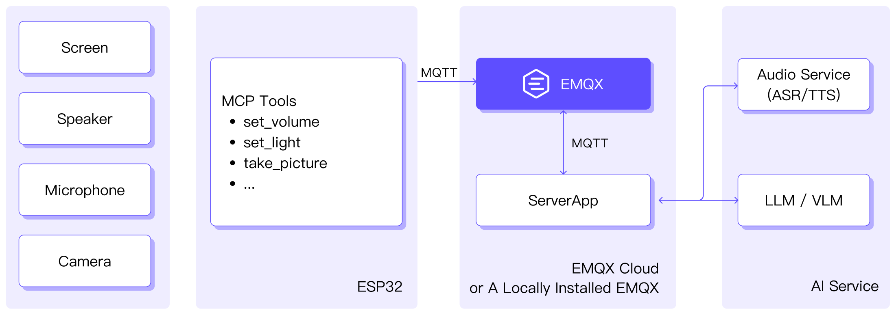

[English](README.md) | [简体中文](README-CN.md)
## AI + IoT Embodied: A Truly "Understanding" Emotional Companion AI

This is the code repo for "Building Your AI Companion with ESP32 & MCP over MQTT from Scratch" blog series.

The development of smart hardware has progressed through several stages: from the initial "network-enabled" to "voice-activated," and now, we envision devices that not only understand your words but also respond, and even offer companionship. Imagine the following scenarios:

- Returning home from work, it proactively greets you: "You look a bit tired today. Would you like me to dim the lights and play some soft music?"
- When your child chats with it, it can narrate stories using different character voices.
- You open the camera, it observes your outfit, and humorously responds: "That's a very stylish look today!"

This isn't just sci-fi; it's the inevitable trend resulting from the convergence of **Large Language Models (LLM)**, **Multimodal AI**, and **IoT** technologies.

Traditional IoT devices primarily rely on "command-based control," where the system controls devices through hardcoded logic or pre-set rules, lacking the ability to intelligently perceive changes in device status. Future devices, however, will move towards **semantic interaction** and **emotional companionship**. The emotional companion AI is precisely a microcosm of this trend.

### Who Is This Series For?

If you identify with any of the following, this series is for you:

- **Smart Hardware Developers:** Looking to explore how AI can empower IoT.
- **Embedded/IoT Developers:** Integrating AI services to enable voice and visual interaction.
- **Hardware Enthusiasts/Makers:** Wanting to DIY a "soulful" smart assistant.
- **AI Application Developers:** Hoping to transition from cloud-based AI to hardware, achieving an end-to-end experience.

If you've previously worked on smart home, robotics, or AI assistant projects, this series will help you elevate to an entirely new level of interaction.

### Background Knowledge Required

Don't worry, you don't need to be a full-stack guru, but the following knowledge will make your journey smoother:

- **Hardware Development Basics:** Ability to flash ESP32 programs (ESP-IDF).
- **Network Communication Basics:** Understanding the fundamental concepts of the MQTT protocol (publish/subscribe).
- **Python Basics:** Python SDKs will be used for LLMs and cloud applications later on.
- **AI Application Concepts (Optional):** Knowing what LLMs, ASR (Automatic Speech Recognition), and TTS (Text-to-Speech) are.

It's okay if you don't have all this knowledge; the series will explain everything step-by-step and provide out-of-the-box examples.

### Why Build Your Own?

- Commercial products are often closed and not customizable. We aim to build a powerful emotional companion AI using the most economical and straightforward methods.
- By leveraging **open-source hardware (ESP32)** and **cloud-based AI interfaces**, individual developers can create smart AI experiences comparable to commercial products.
- This process will not only allow you to experiment with cool AI hardware but also gain a deep understanding of AI + IoT architecture design and practical implementation.

### Goals of This Tutorial Series

Through a progressive tutorial approach, we will guide you from scratch to build an emotional companion AI that will possess:

- **Voice Interaction:** Understand your speech and respond with a natural tone.
- **Device Control:** Adjust screen brightness, volume, etc., via semantic commands.
- **Personalized Persona:** Set personality and preferences, with some memory capabilities.
- **Visual Understanding:** Identify image content and generate fun feedback.

Ultimately, you will achieve experiences like:

- "Hey, dim the screen a bit." → "Got it, dimmed! Is that more comfortable?"
- "Take a look at me, how do I look?" → *The AI takes a photo and uploads it* → "Well hello there, gorgeous! You're really turning heads today!"

### Roadmap

| **Chapter** | **Feature**                                                  | **Difficulty** |
| ----------- | ------------------------------------------------------------ | -------------- |
| 1           | Overview: Background + Environment Setup + Device Online     | ★              |
| 2           | From "Command-Based" to "Semantic Control": MCP over MQTT Encapsulation of Device Capabilities | ★★             |
| 3           | Integrating LLM for "Natural Language → Device Control"      | ★★             |
| 4           | Voice I/O: Microphone Data Upload + Speech Recognition + Speech Synthesis Playback | ★★★            |
| 5           | Persona, Emotion, Memory: From "Controller" to "Companion"   | ★★★            |
| 6           | Giving the AI "Eyes": Image Acquisition + Multimodal Understanding | ★★★            |

## Tech Stack at a Glance

- **ESP32:** This is our go-to for smart hardware projects due to its low cost, built-in Wi-Fi/Bluetooth, and rich peripheral set.
- **MQTT Protocol:** A lightweight, real-time, and cross-platform messaging protocol—an IoT standard.
- **MCP (Model Context Protocol) Over MQTT:** This allows **LLMs** to directly control hardware through "tool calling." Device services register their "capabilities," making AI calls natural and standardized.
- **AI Capabilities:**
  - **LLM:** Handles natural language and control intent.
  - **ASR/TTS:** For voice recognition and synthesis.
  - **VLM (Multimodal Large Model):** Enables visual understanding and generates engaging descriptions.
- **Cloud Services:**
  - **EMQX Serverless:** Or a locally installed EMQX instance.
  - **Open-Source AI Frameworks:** LangChain / LangFlow / LlamaIndex. For this series, we're using **LlamaIndex**.

In a nutshell, our architecture can be summarized as: **ESP32** acts as the "hardware executor," cloud AI serves as the "brain," and **MQTT + MCP** form the "neural pathways."

## Hardware List

To complete all the functionalities in this tutorial, we recommend the following hardware:

- **ESP32-S3-DevKitC:** (Experienced developers can choose other models.)
- **INMP441 Microphone Module**
- **MAX98357A Audio Amplifier**
- **2-3W Speaker**
- **IIC Interface LCD Display**
- **OV2640 Camera Module**
- **400-point Breadboard and Jumper Wires**

## Overall System Architecture Design

- **Hardware Layer:** ESP32 + Microphone + Speaker + Camera + Screen.
- **Connectivity Layer:** MQTT Broker (EMQX) + MCP Protocol.
- **AI Service Layer:** Natural language processing, speech synthesis, visual recognition, and persona logic.

For AI services, this article utilizes Alibaba Cloud's services for speech recognition, speech synthesis, large language models, and multimodal large models.